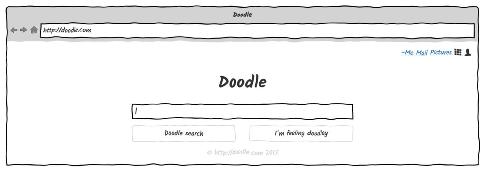
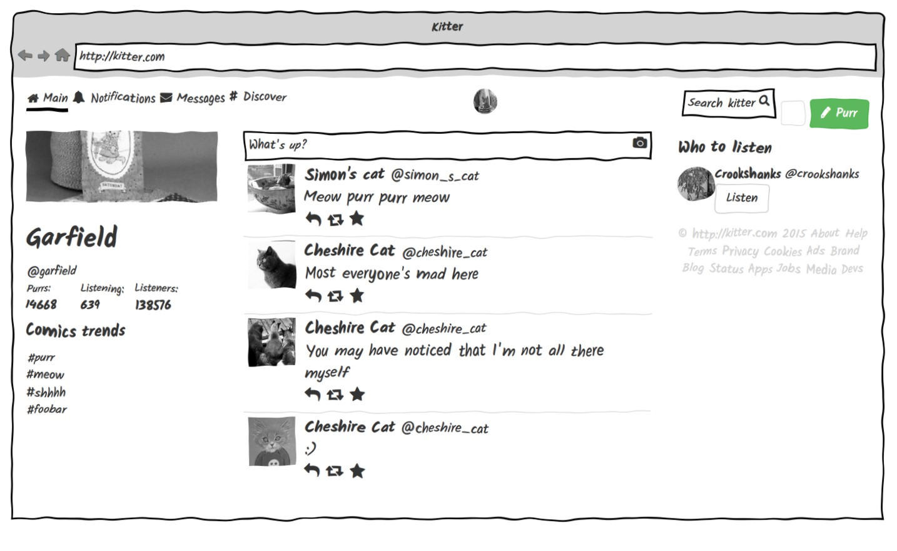

= Shireframe
:toc:
:toc-placement: preamble

Declarative wireframes for programmers, based on
open web technologies.

== Motivation

Sometimes, you need to communicate to other people on what
your software will do and how.
The most efficient way is to create wireframes to show functionality and layouts.
However, if you are a programmer, it is likely that writing code is easier for you
than drawing boxes in an unfamiliar graphics editor.

*Shireframe* allows you to create wireframes by writing HTML
using your favorite IDE, preview results in your favorite browser,
branch/diff/merge wireframes as code in your favorite VCS
and do anything else you usually do with source code.

Shireframe includes ready-made styling for sketchy look-and-feel,
a number of reusable components, and bundled great libraries to simplify your life.

Interactivity support comes _for free_ thanks to web technologies!

== Example

[source, html]
----
<!DOCTYPE html>
<html>
	<head>
		
		<title>Doodle</title>
	</head>
	<body>
		<browser-chrome>
			

				

					<a>~Me</a>
					<a>Mail</a>
					<a>Pictures</a>
					<glyphicon th></glyphicon>
					<glyphicon user></glyphicon>
				

				

					<row>
						<col-6 col-offset-3>
							<h1 class="text-title text-center"></h1>
							<box class="width-100 vertical-margin">|</box>
						</col-6>
					</row>
					<row>
						<col-3 col-offset-3>
							<button class="btn btn-default width-100">Doodle search</button>
						</col-3>
						<col-3>
							<button class="btn btn-default width-100">I'm feeling doodley</button>
						</col-3>
					</row>
				

				<footer class="vertical-margin">
					&copy; <text-url></text-url> 2015
				</footer>
			

		</browser-chrome>
	</body>
</html>
----

== What's inside?

Shireframe includes the following libraries:

* AngularJS drives the HTML and simplifies interactivity,
* jQuery handles DOM manipulation,
* RequireJS loads modules and styles,
* Bootstrap provides solid foundation for layout and a number
of helpful utility classes,
* Lodash is a great utility belt,
* Google font "Kalam" which looks hand-written while supporting
both normal and bold styles (a rare combination),
* and FontAwesome, because it _is_ awesome indeed.

You can use any features from these libraries, and also include and use any other JavaScript libraries you like.

== Getting started

. Create an HTML5 document and include a JS script.
+
[source, html]

. And just start including your content into document body.
  Make sure to use some bundled goodness described below.

. Profit!

== More examples

See the source code in `examples` folder

== Components

Most components are actually AngularJS directives or special CSS styles.

Here's an exhaustive list:

=== Tags

NOTE: Make sure all closing elements match their opening counterparts.
Remember that it doesn't work with self-closed tags like
`<this />`.footnote:[https://github.com/angular/angular.js/issues/1953]

==== `box`

A `box` is just a div with a preset black border.
You may use it as fake inputbox or whatever.
Pipe symbol (`|`) may denote a cursor within such an inputbox.

[source, html]
<box>Hello there!|</box>

as an attribute

class is also ok

==== `row`, `col-*`, `col-offset-*`

A `row`, `col-1` ... `col-12` are shorthands for Bootstrap's grid classes
`row` and `col-xs-*`.
It is shorter to read and write than `
`.

[source, html]
<row>
	<col-3 col-offset-1>First column</col-3>
	<col-3>Second column</col-3>
	<b col-3>Abusing B to make third column bold</b>
</row>

==== `fa`, `glyphicon`

Shorthands for FontAwesome and Glyphicon classes.
They also turn all attributes into prefixed classes.

[source, html]
<fa star></fa>
<fa gear fw 5x spin></fa>
<glyphicon user></glyphicon>

==== `kitten`

Inserts a random kitten photo from teh internet.
Each next tag instance will have a different picture,
but they persist across page reloads.
Use it as a placeholder for images or user photos. Fun!

[source, html]
<kitten></kitten>
<kitten size="5em"></kitten>

==== `browser-chrome`

Wrap your content in `<browser-chrome> ... </browser-chrome>`
to have a nice fake window border with a title, address bar and nav buttons.
Of course, they are fake and don't react to clicks, but allow you to express
your app environment ("my app works in a web browser").

[source, html]
<browser-chrome>
	Look, a kitty in my web browser: <kitten></kitten>
</browser-chrome>

This has nothing to do with with Google Chrome.
It's just any browser's UI is frequently called
_chrome_.footnote:[http://www.nngroup.com/articles/browser-and-gui-chrome/]

==== `text-title`

Shows the same thing as in your `<title>` or _awesome_ default if there isn't any title.
Used in browser-chrome and potentially many other places.

[source, html]
<text-title></text-title>
<h1 text-title></h1>

==== `text-url`

Like `text-title`, but transforms it to fake url like `http://awesome.com`.

[source, html]
<text-url></text-url>

==== Planned for future

* [ ] `my-profile-photo` which is the same in every tag instance
* [ ] `random-profile-photo` which is different in every tag instance
* [ ] `random-logo` an abstract shape
* [ ] `login-form` username-password (or email-password) form with a "login" button
* [ ] `template-navbar` a ready navbar will include
random-logo, title, searchbar,
gear button (aka settings), my-profile-photo and a logout button
* [ ] `template-footer` a ready footer will include a made-up
copyright statement and a few made-up links
* [ ] `ipad-chrome` with orientation parameter
* [ ] `ipad-browser-chrome`
* [ ] `iphone-chrome`
* [ ] `iphone-browser-chrome`
* [ ] `android-chrome`
* [ ] `mac-native-app-chrome`
* [ ] `windows-native-app-chrome`
* [ ] `lorem-ipsum` placeholder text that looks like latin
* [ ] `nonsense` random placeholder text that looks like
syntactically correct English but has no meaning
* [ ] `video-player`
* [ ] `audio-player`
* [ ] `cheerful-comment`
* [ ] `angry-comment`
* [ ] `random-pie-chart` based on d3.js and c3.js
* [ ] `random-bar-chart`
* [ ] `random-line-chart`

and more... Contributions welcome!

=== CSS classes

With one-time wireframes that will be thrown out soon,
it is likely that you won't care about separating
and reusing future-proof CSS rules.
Instead, inline styles are the way to go.

That's why I provide a number of helper
classes for you to use along with Bootstrap's tools to perform common tasks.

==== `h*, .h*`

Overrides Bootstrap's font-weight to 600
which is supported by bundled handwriting font.

==== `vertical-margin`

Adds 1em vertical space to the top and bottom of your element.

[source, html]
<row class="vertical-margin"></row>

==== `overflow-auto`

An alias for `style="overflow: auto"`

==== `width-100`

An alias for `style="width: 100%"`

==== `display-block`

An alias for `style="display: block"`

==== `display-inline-block`

An alias for `style="display: inline-block"`

== Interactivity

In the simplest form, you could create several `*.html` files,
and link them together using `<a href="...">` links.
You probably know that already :-)

Another possibility is to use AngularJS directives
that add behavior like `ng-click`.
Refer to AngularJS docs for more info.

Just remember that your wireframe is an ordinary HTML page
and you can do anything you want with the page.

== Data-driven

TODO

== Create your own reusable components / API

TODO

== Including other scripts & code

TODO

== Browser support

Shireframe uses cutting-edge web technologies,
so only evergreen browsers are supported.
Safari, Chrome, Firefox are ok.
Sorry, IE users.

Also, SVG filter which is used to distort wireframe for "sketchy" look
is completely broken on iOS,
so you have to opt-out of filtering
or use pre-rendered images to show wireframes on iPads and iPhones.

== Render to PNG

There's a script included in make-screenshot
directory which will render a hi-res version of your wireframe.

To make it work, you have to install PhantomJS 2.0
(1.x branch won't work) and ImageMagick.footnote:[
PhantomJS seems to ignore SVG filters,
so ImageMagick is used instead to achieve the same effect]

On Mac OS X with MacPorts, the following commands
will bring in everything you need.

[source]
sudo port install phantomjs
sudo port install ImageMagick

== License

This project is licensed under the terms of GNU GPLv2 (GNU General Public License version 2) or later.

Shireframe is distributed in the hope that it will be useful,
but WITHOUT ANY WARRANTY; without even the impliged warranty of
MERCHANTABILITY or FITNESS FOR A PARTICULAR PURPOSE.  See the
GNU General Public License for more details.

== Contributing

Fork, hack, push and pull-request. Contributions welcome!

Also, please help spreading the word and freeing your fellow
colleague programmers from having to struggle with
mouse-driven graphics editors.

== Why the name?

**W** in **w**ireframe looks like Cyrillic **Ш** (sh).
That's it.

== Author

Vyacheslav Tverskoy <tsx@tsx.su>

If you have any questions, feedback or just want to say thanks,
ping me at Twitter http://twitter.com/tsxxst[@tsxxst]
